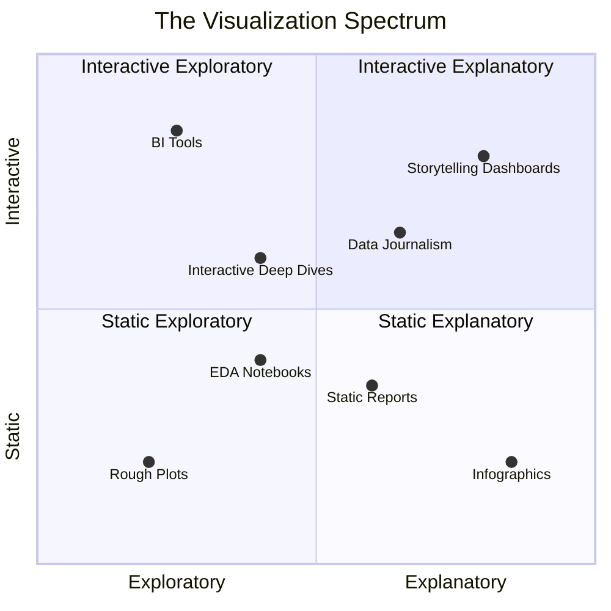

# AI for Data Visualization
## Workshop

### Agenda

1. Overviews: 
    -  **Fundamentals of Data Visualization**
    -  **Integrating AI in Data Visualization**
    -  **Risks and Limitations**
2. Hands on Workshop:
    - Creating a visualization 

Workshop:

1. Data Analysis via ChatAI

Use Claude or ChatGPT or another system to analyize a dataset. Try asking it a question about the weather dataset in data/4354766.csv. Does it give good answers and perform good analysis?

2. Infographics via ChatAI

Use Claude or Gemini or another system to make an inforgraphic. I recommend using an existing data source or summary. Take a look at some of the reports that the Ballston BID has and make an infographic out of one of them:  https://www.ballstonva.org/ballston-bid/plansandreports/

3. Interactive dashboard via ChatAI

Use Claude or Gemini or another system to make an interactive dashboard.   Use the weather dataset in data/4354766.csv. Is the dashboard interactive and correct?

4. Code generation via local Agentic Coding Agent.

Use Claude Code or another agentic coding tool to make an interactive dashboard using the weather dataset. Is the dashboard interactive and correct?

# I. Fundamentals of Data Visualization

* **Primary Goal:** Effective communication.
* **Key Considerations:**
  * Define the objective (What are we trying to achieve?).
  * Identify the audience and their needs.
  * Determine the desired takeaway and intended actions.
* **Output Formats:** Ranges from static (infographics/print) to fully interactive (exploratory).

# II. The Two Modes of Visualization

* **Exploratory (Understanding):** Used to generate insights, explore the unknown, and determine if the data contains useful information.
* **Explanatory (Communicating):** Used to convey a specific, pre-determined message.
* **The Visualization Spectrum:**
  * **Axis 1:** Static $\leftrightarrow$ Interactive.
  * **Axis 2:** Exploratory $\leftrightarrow$ Explanatory.

* **Critical Distinction:** Confusing these two modes (e.g., requesting a dashboard for exploration but wanting an infographic for a presentation) leads to project frustration.

# III. Integrating AI in Data Visualization

* **Core Benefit:** Rapid iteration and increased accessibility for non-experts.
* **Capabilities:**
  * **Direct Analysis:** Using LLMs (ChatGPT, Claude, Gemini) for quick plots and infographics.
  * **Tool Integration:** Using AI to build interactive dashboards.
  * **Code Generation:** Using AI to write code for visualizations to ensure repeatability and easier debugging.
* **Effectiveness:**
  * **Straightforward Data:** AI is highly efficient and often correct (90-95% of the time).
  * **Complex Data:** AI struggles; results become less reliable.

# IV. Risks and Limitations

* **Accuracy:** Risk of "hallucinations" or incorrect data analysis.
* **Robustness:** AI is less robust than a skilled human expert when handling non-obvious data.
* **Requirement:** Human oversight is essential; users must remain suspicious and thoughtful regarding AI outputs.

Workshop:

1. Data Analysis via ChatAI (ChatGPT, Claude, Gemini, Etc)

2. Infographics via ChatAI (ChatGPT, Claude, Gemini, Etc)

3. Interactive dashboard via ChatAI (ChatGPT, Claude, Gemini, Etc)

4. Code generation via local Agentic Coding Agent. (Claude Code, OpenAI Codex, OpenCode, etc)
